```r
data_folder <- "factorial_design"
data_from <- "Interaction"
file_name <- "interaction - testing.xlsx"
```


```r
#import data and create data table

file_path <- here(data_folder, data_from, file_name)
interaction_data_raw <- read_excel(file_path,
                                     sheet = "Sheet1",
                                     range = "A1:Z476") %>%
  clean_names()  %>%
  data.table()
#View(interaction_data_table)
#relevant rows & columns
interaction_data <- interaction_data_raw[
  include == "yes", 
  !c(
    "include","doi", "quartile", "year", "issue", "jaw_tests", "jaw", "smb", "comment", "report",  "synergy_used", "antagonism_used",  "ixn_to_support_syn_ant"
    )]

#add new column combining all tests performed
#remove NA's from post hoc column (not relevant)
interaction_data$all_tests <- paste(interaction_data$tests, interaction_data$post_hoc[!is.na(interaction_data$post_hoc)], sep = ",")
```


```r
design_summary <- table(interaction_data$design) %>%
  data.table() 
design_summary$percent <- design_summary$N/sum(design_summary$N)*100
kable(design_summary, col.names = c("design", "freq", "percent"), digits = c(1,1,1)) %>%
  kable_styling()
```

<table class="table" style="margin-left: auto; margin-right: auto;">
 <thead>
  <tr>
   <th style="text-align:left;"> design </th>
   <th style="text-align:right;"> freq </th>
   <th style="text-align:right;"> percent </th>
  </tr>
 </thead>
<tbody>
  <tr>
   <td style="text-align:left;"> 2x2 </td>
   <td style="text-align:right;"> 249 </td>
   <td style="text-align:right;"> 59.0 </td>
  </tr>
  <tr>
   <td style="text-align:left;"> 2x2x2 </td>
   <td style="text-align:right;"> 9 </td>
   <td style="text-align:right;"> 2.1 </td>
  </tr>
  <tr>
   <td style="text-align:left;"> 2x2x2+1 </td>
   <td style="text-align:right;"> 1 </td>
   <td style="text-align:right;"> 0.2 </td>
  </tr>
  <tr>
   <td style="text-align:left;"> 3x2 </td>
   <td style="text-align:right;"> 103 </td>
   <td style="text-align:right;"> 24.4 </td>
  </tr>
  <tr>
   <td style="text-align:left;"> 3x2+1 </td>
   <td style="text-align:right;"> 2 </td>
   <td style="text-align:right;"> 0.5 </td>
  </tr>
  <tr>
   <td style="text-align:left;"> 3x2x2 </td>
   <td style="text-align:right;"> 5 </td>
   <td style="text-align:right;"> 1.2 </td>
  </tr>
  <tr>
   <td style="text-align:left;"> 3x3 </td>
   <td style="text-align:right;"> 6 </td>
   <td style="text-align:right;"> 1.4 </td>
  </tr>
  <tr>
   <td style="text-align:left;"> 4x2 </td>
   <td style="text-align:right;"> 26 </td>
   <td style="text-align:right;"> 6.2 </td>
  </tr>
  <tr>
   <td style="text-align:left;"> 4x3 </td>
   <td style="text-align:right;"> 16 </td>
   <td style="text-align:right;"> 3.8 </td>
  </tr>
  <tr>
   <td style="text-align:left;"> 4x3x2 </td>
   <td style="text-align:right;"> 1 </td>
   <td style="text-align:right;"> 0.2 </td>
  </tr>
  <tr>
   <td style="text-align:left;"> 4x4 </td>
   <td style="text-align:right;"> 1 </td>
   <td style="text-align:right;"> 0.2 </td>
  </tr>
  <tr>
   <td style="text-align:left;"> 5x2 </td>
   <td style="text-align:right;"> 2 </td>
   <td style="text-align:right;"> 0.5 </td>
  </tr>
  <tr>
   <td style="text-align:left;"> 6x4 </td>
   <td style="text-align:right;"> 1 </td>
   <td style="text-align:right;"> 0.2 </td>
  </tr>
</tbody>
</table>

```r
data_availability_summary <- table(interaction_data$data_availability) %>%
  data.table() 
data_availability_summary$percent <- data_availability_summary$N/sum(data_availability_summary$N)*100
kable(data_availability_summary, col.names = c("data_availability", "freq", "percent"), digits = c(1,1,1)) %>%
  kable_styling()
```

<table class="table" style="margin-left: auto; margin-right: auto;">
 <thead>
  <tr>
   <th style="text-align:left;"> data_availability </th>
   <th style="text-align:right;"> freq </th>
   <th style="text-align:right;"> percent </th>
  </tr>
 </thead>
<tbody>
  <tr>
   <td style="text-align:left;"> no </td>
   <td style="text-align:right;"> 365 </td>
   <td style="text-align:right;"> 86.5 </td>
  </tr>
  <tr>
   <td style="text-align:left;"> yes </td>
   <td style="text-align:right;"> 57 </td>
   <td style="text-align:right;"> 13.5 </td>
  </tr>
</tbody>
</table>

```r
analysis_summary <- table(interaction_data$analysis) %>%
  data.table() 
analysis_summary$percent <- analysis_summary$N/sum(analysis_summary$N)*100
kable(analysis_summary, col.names = c("analysis", "freq", "percent"), digits = c(1,1,1)) %>%
  kable_styling()
```

<table class="table" style="margin-left: auto; margin-right: auto;">
 <thead>
  <tr>
   <th style="text-align:left;"> analysis </th>
   <th style="text-align:right;"> freq </th>
   <th style="text-align:right;"> percent </th>
  </tr>
 </thead>
<tbody>
  <tr>
   <td style="text-align:left;"> factorial </td>
   <td style="text-align:right;"> 54 </td>
   <td style="text-align:right;"> 14.2 </td>
  </tr>
  <tr>
   <td style="text-align:left;"> flat </td>
   <td style="text-align:right;"> 325 </td>
   <td style="text-align:right;"> 85.8 </td>
  </tr>
</tbody>
</table>

```r
t_tests_summary <- table(interaction_data$t_tests) %>%
  data.table() 
t_tests_summary$percent <- t_tests_summary$N/sum(t_tests_summary$N)*100
kable(t_tests_summary, col.names = c("t_tests", "freq", "percent"), digits = c(1,1,1)) %>%
  kable_styling()
```

<table class="table" style="margin-left: auto; margin-right: auto;">
 <thead>
  <tr>
   <th style="text-align:left;"> t_tests </th>
   <th style="text-align:right;"> freq </th>
   <th style="text-align:right;"> percent </th>
  </tr>
 </thead>
<tbody>
  <tr>
   <td style="text-align:left;"> combined </td>
   <td style="text-align:right;"> 160 </td>
   <td style="text-align:right;"> 42.2 </td>
  </tr>
  <tr>
   <td style="text-align:left;"> separate </td>
   <td style="text-align:right;"> 219 </td>
   <td style="text-align:right;"> 57.8 </td>
  </tr>
</tbody>
</table>

```r
tests_summary <- table(interaction_data$tests) %>%
  data.table() 
tests_summary$percent <- tests_summary$N/sum(tests_summary$N)*100
kable(tests_summary, col.names = c("tests", "freq", "percent"), digits = c(1,1,1)) %>%
  kable_styling()
```

<table class="table" style="margin-left: auto; margin-right: auto;">
 <thead>
  <tr>
   <th style="text-align:left;"> tests </th>
   <th style="text-align:right;"> freq </th>
   <th style="text-align:right;"> percent </th>
  </tr>
 </thead>
<tbody>
  <tr>
   <td style="text-align:left;"> anova </td>
   <td style="text-align:right;"> 21 </td>
   <td style="text-align:right;"> 5.3 </td>
  </tr>
  <tr>
   <td style="text-align:left;"> duncan </td>
   <td style="text-align:right;"> 2 </td>
   <td style="text-align:right;"> 0.5 </td>
  </tr>
  <tr>
   <td style="text-align:left;"> dunnett </td>
   <td style="text-align:right;"> 1 </td>
   <td style="text-align:right;"> 0.3 </td>
  </tr>
  <tr>
   <td style="text-align:left;"> generalized linear mixed-effects model </td>
   <td style="text-align:right;"> 1 </td>
   <td style="text-align:right;"> 0.3 </td>
  </tr>
  <tr>
   <td style="text-align:left;"> kruskal-wallis </td>
   <td style="text-align:right;"> 4 </td>
   <td style="text-align:right;"> 1.0 </td>
  </tr>
  <tr>
   <td style="text-align:left;"> linear mixed-effects model </td>
   <td style="text-align:right;"> 1 </td>
   <td style="text-align:right;"> 0.3 </td>
  </tr>
  <tr>
   <td style="text-align:left;"> moderated t </td>
   <td style="text-align:right;"> 2 </td>
   <td style="text-align:right;"> 0.5 </td>
  </tr>
  <tr>
   <td style="text-align:left;"> mww </td>
   <td style="text-align:right;"> 19 </td>
   <td style="text-align:right;"> 4.8 </td>
  </tr>
  <tr>
   <td style="text-align:left;"> one-way anova </td>
   <td style="text-align:right;"> 105 </td>
   <td style="text-align:right;"> 26.6 </td>
  </tr>
  <tr>
   <td style="text-align:left;"> one-way anova repeated measures </td>
   <td style="text-align:right;"> 2 </td>
   <td style="text-align:right;"> 0.5 </td>
  </tr>
  <tr>
   <td style="text-align:left;"> one-way anova, kruskal-wallis </td>
   <td style="text-align:right;"> 2 </td>
   <td style="text-align:right;"> 0.5 </td>
  </tr>
  <tr>
   <td style="text-align:left;"> one-way anova, tukey </td>
   <td style="text-align:right;"> 2 </td>
   <td style="text-align:right;"> 0.5 </td>
  </tr>
  <tr>
   <td style="text-align:left;"> paired-sample t test </td>
   <td style="text-align:right;"> 1 </td>
   <td style="text-align:right;"> 0.3 </td>
  </tr>
  <tr>
   <td style="text-align:left;"> t </td>
   <td style="text-align:right;"> 173 </td>
   <td style="text-align:right;"> 43.9 </td>
  </tr>
  <tr>
   <td style="text-align:left;"> tukey </td>
   <td style="text-align:right;"> 2 </td>
   <td style="text-align:right;"> 0.5 </td>
  </tr>
  <tr>
   <td style="text-align:left;"> two-way anova </td>
   <td style="text-align:right;"> 50 </td>
   <td style="text-align:right;"> 12.7 </td>
  </tr>
  <tr>
   <td style="text-align:left;"> two-way anova repeated measures </td>
   <td style="text-align:right;"> 3 </td>
   <td style="text-align:right;"> 0.8 </td>
  </tr>
  <tr>
   <td style="text-align:left;"> welch t </td>
   <td style="text-align:right;"> 3 </td>
   <td style="text-align:right;"> 0.8 </td>
  </tr>
</tbody>
</table>

```r
all_tests_summary <- table(interaction_data$all_tests) %>%
  data.table() 
all_tests_summary$percent <- all_tests_summary$N/sum(all_tests_summary$N)*100
kable(all_tests_summary, col.names = c("all_tests", "freq", "percent"), digits = c(1,1,1)) %>%
  kable_styling()
```

<table class="table" style="margin-left: auto; margin-right: auto;">
 <thead>
  <tr>
   <th style="text-align:left;"> all_tests </th>
   <th style="text-align:right;"> freq </th>
   <th style="text-align:right;"> percent </th>
  </tr>
 </thead>
<tbody>
  <tr>
   <td style="text-align:left;"> anova,bonferroni </td>
   <td style="text-align:right;"> 5 </td>
   <td style="text-align:right;"> 1.2 </td>
  </tr>
  <tr>
   <td style="text-align:left;"> anova,missing </td>
   <td style="text-align:right;"> 4 </td>
   <td style="text-align:right;"> 0.9 </td>
  </tr>
  <tr>
   <td style="text-align:left;"> anova,sidak </td>
   <td style="text-align:right;"> 2 </td>
   <td style="text-align:right;"> 0.5 </td>
  </tr>
  <tr>
   <td style="text-align:left;"> anova,tukey </td>
   <td style="text-align:right;"> 10 </td>
   <td style="text-align:right;"> 2.4 </td>
  </tr>
  <tr>
   <td style="text-align:left;"> duncan,missing </td>
   <td style="text-align:right;"> 2 </td>
   <td style="text-align:right;"> 0.5 </td>
  </tr>
  <tr>
   <td style="text-align:left;"> dunnett,missing </td>
   <td style="text-align:right;"> 1 </td>
   <td style="text-align:right;"> 0.2 </td>
  </tr>
  <tr>
   <td style="text-align:left;"> generalized linear mixed-effects model,bonferroni </td>
   <td style="text-align:right;"> 1 </td>
   <td style="text-align:right;"> 0.2 </td>
  </tr>
  <tr>
   <td style="text-align:left;"> kruskal-wallis,missing </td>
   <td style="text-align:right;"> 2 </td>
   <td style="text-align:right;"> 0.5 </td>
  </tr>
  <tr>
   <td style="text-align:left;"> kruskal-wallis,tukey </td>
   <td style="text-align:right;"> 2 </td>
   <td style="text-align:right;"> 0.5 </td>
  </tr>
  <tr>
   <td style="text-align:left;"> linear mixed-effects model,bonferroni </td>
   <td style="text-align:right;"> 1 </td>
   <td style="text-align:right;"> 0.2 </td>
  </tr>
  <tr>
   <td style="text-align:left;"> moderated t,bonferroni </td>
   <td style="text-align:right;"> 2 </td>
   <td style="text-align:right;"> 0.5 </td>
  </tr>
  <tr>
   <td style="text-align:left;"> mww,bonferroni </td>
   <td style="text-align:right;"> 2 </td>
   <td style="text-align:right;"> 0.5 </td>
  </tr>
  <tr>
   <td style="text-align:left;"> mww,duncan </td>
   <td style="text-align:right;"> 2 </td>
   <td style="text-align:right;"> 0.5 </td>
  </tr>
  <tr>
   <td style="text-align:left;"> mww,dunnett </td>
   <td style="text-align:right;"> 2 </td>
   <td style="text-align:right;"> 0.5 </td>
  </tr>
  <tr>
   <td style="text-align:left;"> mww,missing </td>
   <td style="text-align:right;"> 5 </td>
   <td style="text-align:right;"> 1.2 </td>
  </tr>
  <tr>
   <td style="text-align:left;"> mww,snk </td>
   <td style="text-align:right;"> 2 </td>
   <td style="text-align:right;"> 0.5 </td>
  </tr>
  <tr>
   <td style="text-align:left;"> mww,tukey </td>
   <td style="text-align:right;"> 6 </td>
   <td style="text-align:right;"> 1.4 </td>
  </tr>
  <tr>
   <td style="text-align:left;"> NA,bonferroni </td>
   <td style="text-align:right;"> 7 </td>
   <td style="text-align:right;"> 1.7 </td>
  </tr>
  <tr>
   <td style="text-align:left;"> NA,duncan </td>
   <td style="text-align:right;"> 2 </td>
   <td style="text-align:right;"> 0.5 </td>
  </tr>
  <tr>
   <td style="text-align:left;"> NA,missing </td>
   <td style="text-align:right;"> 9 </td>
   <td style="text-align:right;"> 2.1 </td>
  </tr>
  <tr>
   <td style="text-align:left;"> NA,tukey </td>
   <td style="text-align:right;"> 10 </td>
   <td style="text-align:right;"> 2.4 </td>
  </tr>
  <tr>
   <td style="text-align:left;"> one-way anova repeated measures,snk </td>
   <td style="text-align:right;"> 2 </td>
   <td style="text-align:right;"> 0.5 </td>
  </tr>
  <tr>
   <td style="text-align:left;"> one-way anova, kruskal-wallis,tukey </td>
   <td style="text-align:right;"> 2 </td>
   <td style="text-align:right;"> 0.5 </td>
  </tr>
  <tr>
   <td style="text-align:left;"> one-way anova, tukey,missing </td>
   <td style="text-align:right;"> 2 </td>
   <td style="text-align:right;"> 0.5 </td>
  </tr>
  <tr>
   <td style="text-align:left;"> one-way anova,bonferroni </td>
   <td style="text-align:right;"> 22 </td>
   <td style="text-align:right;"> 5.2 </td>
  </tr>
  <tr>
   <td style="text-align:left;"> one-way anova,dunnett </td>
   <td style="text-align:right;"> 5 </td>
   <td style="text-align:right;"> 1.2 </td>
  </tr>
  <tr>
   <td style="text-align:left;"> one-way anova,holm-sidak </td>
   <td style="text-align:right;"> 1 </td>
   <td style="text-align:right;"> 0.2 </td>
  </tr>
  <tr>
   <td style="text-align:left;"> one-way anova,missing </td>
   <td style="text-align:right;"> 26 </td>
   <td style="text-align:right;"> 6.2 </td>
  </tr>
  <tr>
   <td style="text-align:left;"> one-way anova,scheffe </td>
   <td style="text-align:right;"> 2 </td>
   <td style="text-align:right;"> 0.5 </td>
  </tr>
  <tr>
   <td style="text-align:left;"> one-way anova,sidak </td>
   <td style="text-align:right;"> 13 </td>
   <td style="text-align:right;"> 3.1 </td>
  </tr>
  <tr>
   <td style="text-align:left;"> one-way anova,sidak, dunnett </td>
   <td style="text-align:right;"> 2 </td>
   <td style="text-align:right;"> 0.5 </td>
  </tr>
  <tr>
   <td style="text-align:left;"> one-way anova,tukey </td>
   <td style="text-align:right;"> 34 </td>
   <td style="text-align:right;"> 8.1 </td>
  </tr>
  <tr>
   <td style="text-align:left;"> paired-sample t test,bonferroni </td>
   <td style="text-align:right;"> 1 </td>
   <td style="text-align:right;"> 0.2 </td>
  </tr>
  <tr>
   <td style="text-align:left;"> t,bonferroni </td>
   <td style="text-align:right;"> 32 </td>
   <td style="text-align:right;"> 7.6 </td>
  </tr>
  <tr>
   <td style="text-align:left;"> t,dunn </td>
   <td style="text-align:right;"> 2 </td>
   <td style="text-align:right;"> 0.5 </td>
  </tr>
  <tr>
   <td style="text-align:left;"> t,dunnett </td>
   <td style="text-align:right;"> 3 </td>
   <td style="text-align:right;"> 0.7 </td>
  </tr>
  <tr>
   <td style="text-align:left;"> t,holm-sidak </td>
   <td style="text-align:right;"> 3 </td>
   <td style="text-align:right;"> 0.7 </td>
  </tr>
  <tr>
   <td style="text-align:left;"> t,missing </td>
   <td style="text-align:right;"> 53 </td>
   <td style="text-align:right;"> 12.6 </td>
  </tr>
  <tr>
   <td style="text-align:left;"> t,sidak </td>
   <td style="text-align:right;"> 24 </td>
   <td style="text-align:right;"> 5.7 </td>
  </tr>
  <tr>
   <td style="text-align:left;"> t,sidak's multiple comparison </td>
   <td style="text-align:right;"> 2 </td>
   <td style="text-align:right;"> 0.5 </td>
  </tr>
  <tr>
   <td style="text-align:left;"> t,sidak, dunnett </td>
   <td style="text-align:right;"> 1 </td>
   <td style="text-align:right;"> 0.2 </td>
  </tr>
  <tr>
   <td style="text-align:left;"> t,snk </td>
   <td style="text-align:right;"> 4 </td>
   <td style="text-align:right;"> 0.9 </td>
  </tr>
  <tr>
   <td style="text-align:left;"> t,t </td>
   <td style="text-align:right;"> 4 </td>
   <td style="text-align:right;"> 0.9 </td>
  </tr>
  <tr>
   <td style="text-align:left;"> t,tukey </td>
   <td style="text-align:right;"> 45 </td>
   <td style="text-align:right;"> 10.7 </td>
  </tr>
  <tr>
   <td style="text-align:left;"> tukey,dunn </td>
   <td style="text-align:right;"> 2 </td>
   <td style="text-align:right;"> 0.5 </td>
  </tr>
  <tr>
   <td style="text-align:left;"> two-way anova repeated measures,tukey </td>
   <td style="text-align:right;"> 3 </td>
   <td style="text-align:right;"> 0.7 </td>
  </tr>
  <tr>
   <td style="text-align:left;"> two-way anova,bonferroni </td>
   <td style="text-align:right;"> 18 </td>
   <td style="text-align:right;"> 4.3 </td>
  </tr>
  <tr>
   <td style="text-align:left;"> two-way anova,missing </td>
   <td style="text-align:right;"> 16 </td>
   <td style="text-align:right;"> 3.8 </td>
  </tr>
  <tr>
   <td style="text-align:left;"> two-way anova,scheffe </td>
   <td style="text-align:right;"> 2 </td>
   <td style="text-align:right;"> 0.5 </td>
  </tr>
  <tr>
   <td style="text-align:left;"> two-way anova,sidak </td>
   <td style="text-align:right;"> 2 </td>
   <td style="text-align:right;"> 0.5 </td>
  </tr>
  <tr>
   <td style="text-align:left;"> two-way anova,tukey </td>
   <td style="text-align:right;"> 12 </td>
   <td style="text-align:right;"> 2.8 </td>
  </tr>
  <tr>
   <td style="text-align:left;"> welch t,bonferroni </td>
   <td style="text-align:right;"> 2 </td>
   <td style="text-align:right;"> 0.5 </td>
  </tr>
  <tr>
   <td style="text-align:left;"> welch t,missing </td>
   <td style="text-align:right;"> 1 </td>
   <td style="text-align:right;"> 0.2 </td>
  </tr>
</tbody>
</table>

```r
post_hoc_summary <- table(interaction_data$post_hoc) %>%
  data.table() 
post_hoc_summary$percent <- post_hoc_summary$N/sum(post_hoc_summary$N)*100
kable(post_hoc_summary, col.names = c("post_hoc", "freq", "percent"), digits = c(1,1,1)) %>%
  kable_styling()
```

<table class="table" style="margin-left: auto; margin-right: auto;">
 <thead>
  <tr>
   <th style="text-align:left;"> post_hoc </th>
   <th style="text-align:right;"> freq </th>
   <th style="text-align:right;"> percent </th>
  </tr>
 </thead>
<tbody>
  <tr>
   <td style="text-align:left;"> bonferroni </td>
   <td style="text-align:right;"> 41 </td>
   <td style="text-align:right;"> 22.2 </td>
  </tr>
  <tr>
   <td style="text-align:left;"> duncan </td>
   <td style="text-align:right;"> 2 </td>
   <td style="text-align:right;"> 1.1 </td>
  </tr>
  <tr>
   <td style="text-align:left;"> dunn </td>
   <td style="text-align:right;"> 2 </td>
   <td style="text-align:right;"> 1.1 </td>
  </tr>
  <tr>
   <td style="text-align:left;"> dunnett </td>
   <td style="text-align:right;"> 4 </td>
   <td style="text-align:right;"> 2.2 </td>
  </tr>
  <tr>
   <td style="text-align:left;"> holm-sidak </td>
   <td style="text-align:right;"> 2 </td>
   <td style="text-align:right;"> 1.1 </td>
  </tr>
  <tr>
   <td style="text-align:left;"> missing </td>
   <td style="text-align:right;"> 52 </td>
   <td style="text-align:right;"> 28.1 </td>
  </tr>
  <tr>
   <td style="text-align:left;"> scheffe </td>
   <td style="text-align:right;"> 2 </td>
   <td style="text-align:right;"> 1.1 </td>
  </tr>
  <tr>
   <td style="text-align:left;"> sidak </td>
   <td style="text-align:right;"> 17 </td>
   <td style="text-align:right;"> 9.2 </td>
  </tr>
  <tr>
   <td style="text-align:left;"> sidak's multiple comparison </td>
   <td style="text-align:right;"> 1 </td>
   <td style="text-align:right;"> 0.5 </td>
  </tr>
  <tr>
   <td style="text-align:left;"> sidak, dunnett </td>
   <td style="text-align:right;"> 1 </td>
   <td style="text-align:right;"> 0.5 </td>
  </tr>
  <tr>
   <td style="text-align:left;"> snk </td>
   <td style="text-align:right;"> 4 </td>
   <td style="text-align:right;"> 2.2 </td>
  </tr>
  <tr>
   <td style="text-align:left;"> t </td>
   <td style="text-align:right;"> 2 </td>
   <td style="text-align:right;"> 1.1 </td>
  </tr>
  <tr>
   <td style="text-align:left;"> tukey </td>
   <td style="text-align:right;"> 55 </td>
   <td style="text-align:right;"> 29.7 </td>
  </tr>
</tbody>
</table>

```r
ixn_reported_summary <- table(interaction_data$ixn_reported) %>%
  data.table() 
ixn_reported_summary$percent <- ixn_reported_summary$N/sum(ixn_reported_summary$N)*100
kable(ixn_reported_summary, col.names = c("ixn_reported", "freq", "percent"), digits = c(1, 1, 1)) %>%
  kable_styling()
```

<table class="table" style="margin-left: auto; margin-right: auto;">
 <thead>
  <tr>
   <th style="text-align:left;"> ixn_reported </th>
   <th style="text-align:right;"> freq </th>
   <th style="text-align:right;"> percent </th>
  </tr>
 </thead>
<tbody>
  <tr>
   <td style="text-align:left;"> no </td>
   <td style="text-align:right;"> 378 </td>
   <td style="text-align:right;"> 96.9 </td>
  </tr>
  <tr>
   <td style="text-align:left;"> yes </td>
   <td style="text-align:right;"> 12 </td>
   <td style="text-align:right;"> 3.1 </td>
  </tr>
</tbody>
</table>


### Pairwise comparisons

design by journal

```r
journal_vs_design <- ggplot(data = interaction_data,
                            aes(x =  design,
                                y = journal,
                                color = rank)) +
  geom_point(alpha = 0.5, show.legend = FALSE) +
  geom_jitter(width = 0.3, show.legend = TRUE) +
  theme(axis.text.x = element_text(angle = 90, hjust = 1),
        axis.text.y = element_blank())

journal_vs_design
```

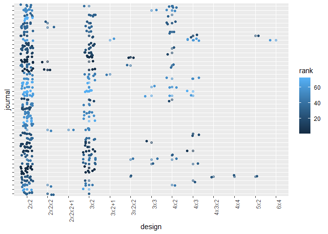<!-- -->

data availability by journal

```r
journal_vs_data_availability <- ggplot(data = interaction_data,
                                       aes(x =  data_availability,
                                           y = journal,
                                           color = rank)) +
  geom_point(alpha = 0.5, show.legend = FALSE) +
  geom_jitter(width = 0.3, show.legend = TRUE) +
    theme(axis.text.y = element_blank())

journal_vs_data_availability
```

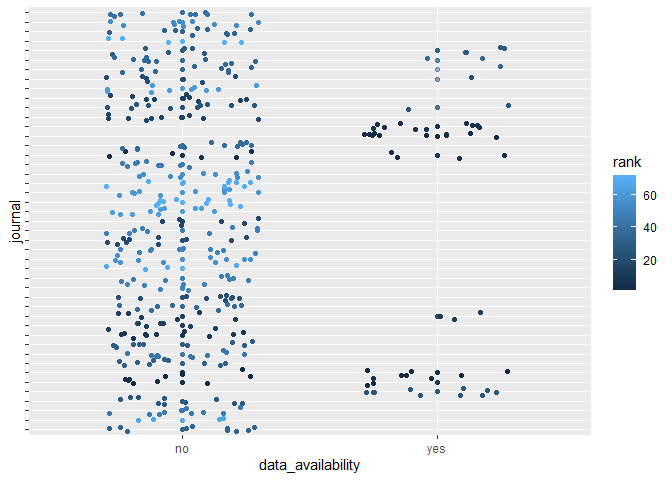<!-- -->


journal vs analysis

```r
journal_vs_analysis <- ggplot(data = interaction_data,
                                aes(x =  analysis,
                                    y = journal,
                                    color = rank)) +
  geom_point(alpha = 0.5, show.legend = FALSE) +
  geom_jitter(width = 0.3, show.legend = TRUE) +
    theme(axis.text.y = element_blank())

journal_vs_analysis
```

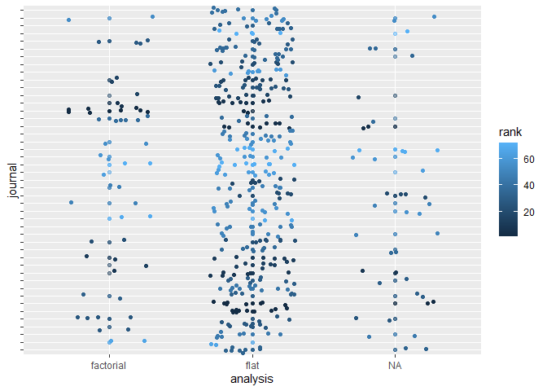<!-- -->


t tests by journal

```r
journal_vs_t_tests <- ggplot(data = interaction_data,
                             aes(x =  t_tests,
                                 y = journal,
                                 color = rank)) +
  geom_point(alpha = 0.5, show.legend = FALSE) +
  geom_jitter(width = 0.3, show.legend = TRUE) +
  theme(axis.text.y = element_blank())

journal_vs_t_tests
```

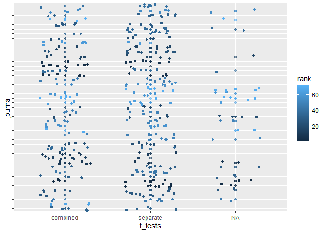<!-- -->

tests by journal

```r
journal_vs_tests <- ggplot(data = interaction_data,
                           aes(x =  tests,
                               y = journal,
                               color = rank)) +
  geom_point(alpha = 0.5, show.legend = FALSE) +
  geom_jitter(width = 0.3, show.legend = TRUE) +
  #theme(axis.text.x = element_text(angle = 90, hjust = 1)) #to view test names
  theme(axis.text.x = element_blank(),
        axis.text.y = element_blank())

journal_vs_tests
```

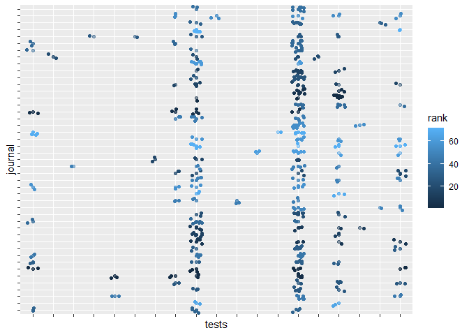<!-- -->

post hoc by journal

```r
journal_vs_post_hoc <- ggplot(data = interaction_data,
                              aes(x =  post_hoc,
                                  y = journal,
                                  color = rank)) +
  geom_point(alpha = 0.5, show.legend = FALSE) +
  geom_jitter(width = 0.3, show.legend = TRUE) +
  theme(axis.text.x = element_text(angle = 90, hjust = 1),
        axis.text.y = element_blank())

journal_vs_post_hoc
```

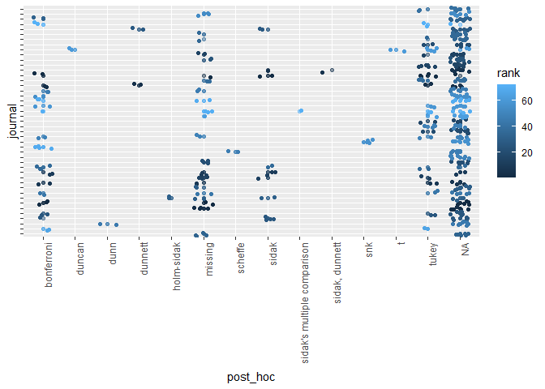<!-- -->

all tests by journal

```r
journal_vs_all_tests <- ggplot(data = interaction_data,
                           aes(x =  all_tests,
                               y = journal,
                               color = rank)) +
  geom_point(alpha = 0.5, show.legend = FALSE) +
  geom_jitter(width = 0.3, show.legend = TRUE) +
  #theme(axis.text.x = element_text(angle = 90, hjust = 1)) #to view test names
  theme(axis.text.x = element_blank(),
        axis.text.y = element_blank())

journal_vs_all_tests
```

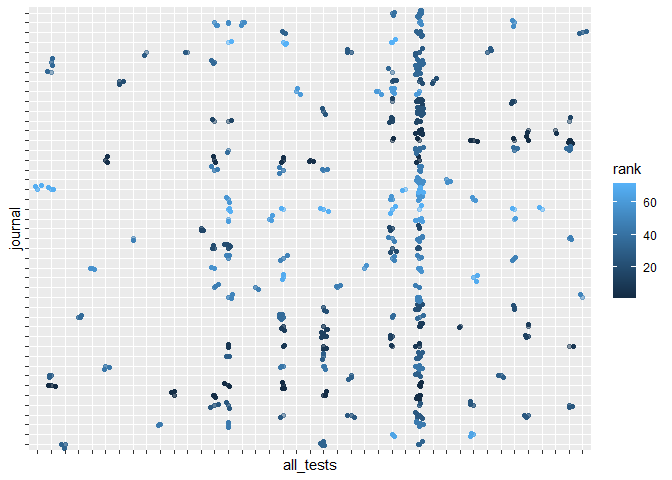<!-- -->

interaction by journal

```r
journal_vs_ixn_reported <- ggplot(data = interaction_data,
                                  aes(x =  ixn_reported,
                                      y = journal,
                                      color = rank)) +
  geom_point(alpha = 0.5, show.legend = FALSE) +
  geom_jitter(width = 0.3, show.legend = TRUE) +
  theme(axis.text.y = element_blank())

journal_vs_ixn_reported
```

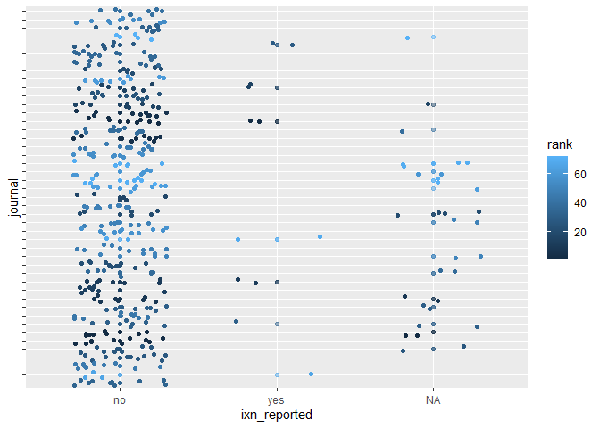<!-- -->

design by rank

```r
rank_vs_design <- ggplot(data = interaction_data,
                                  aes(x =  design,
                                      y = rank,
                                      color = journal)) +
  geom_point(alpha = 0.5, show.legend = FALSE) +
  geom_jitter(width = 0.3, show.legend = FALSE) +
  theme(axis.text.x = element_text(angle = 90, hjust = 1))

rank_vs_design
```

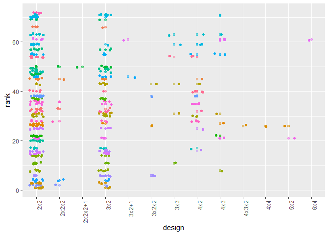<!-- -->


data availability by rank

```r
rank_vs_data_availability <- ggplot(data = interaction_data,
                                  aes(x = data_availability,
                                      y = rank,
                                      color = journal)) +
  geom_point(alpha = 0.5, show.legend = FALSE) +
  geom_jitter(width = 0.3, show.legend = FALSE) 

rank_vs_data_availability
```

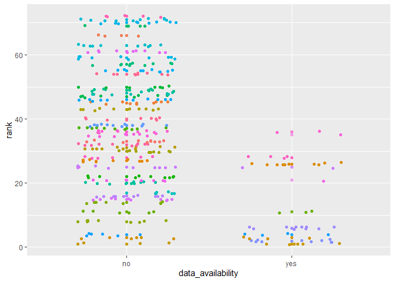<!-- -->

analysis by rank

```r
rank_vs_analysis <- ggplot(data = interaction_data,
                                  aes(x = analysis,
                                      y = rank,
                                      color = journal)) +
  geom_point(alpha = 0.5, show.legend = FALSE) +
  geom_jitter(width = 0.3, show.legend = FALSE) 

rank_vs_analysis
```

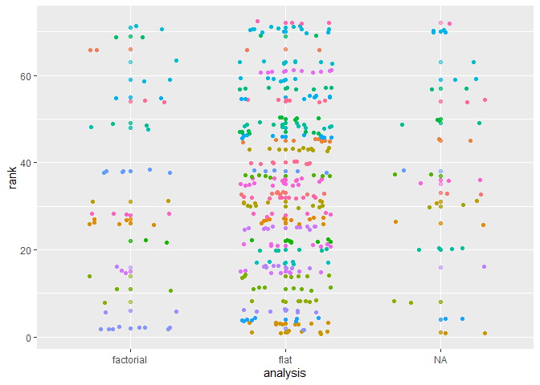<!-- -->

t tests by rank

```r
rank_vs_t_tests <- ggplot(data = interaction_data,
                                  aes(x = t_tests,
                                      y = rank,
                                      color = journal)) +
  geom_point(alpha = 0.5, show.legend = FALSE) +
  geom_jitter(width = 0.3, show.legend = FALSE) 

rank_vs_t_tests
```

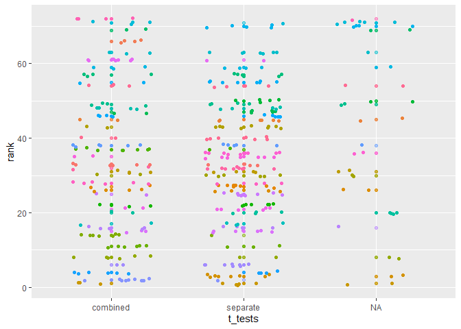<!-- -->

tests by rank

```r
rank_vs_tests <- ggplot(data = interaction_data,
                                  aes(x = tests,
                                      y = rank,
                                      color = journal)) +
  geom_point(alpha = 0.5, show.legend = FALSE) +
  geom_jitter(width = 0.3, show.legend = FALSE) +
  theme(axis.text.x = element_text(angle = 90, hjust = 1))

rank_vs_tests
```

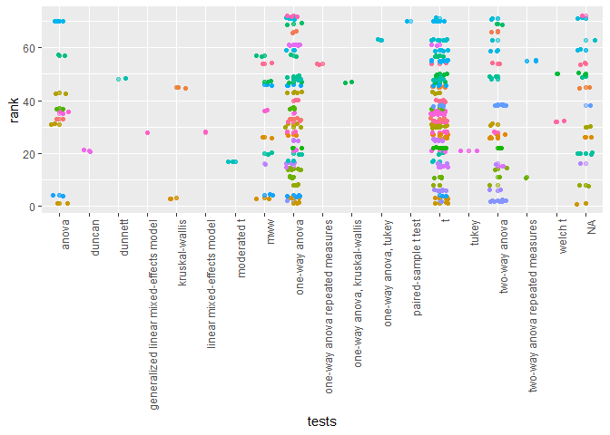<!-- -->

post hoc by rank

```r
rank_vs_post_hoc <- ggplot(data = interaction_data,
                                  aes(x = post_hoc,
                                      y = rank,
                                      color = journal)) +
  geom_point(alpha = 0.5, show.legend = FALSE) +
  geom_jitter(width = 0.3, show.legend = FALSE) +
  theme(axis.text.x = element_text(angle = 90, hjust = 1))

rank_vs_post_hoc
```

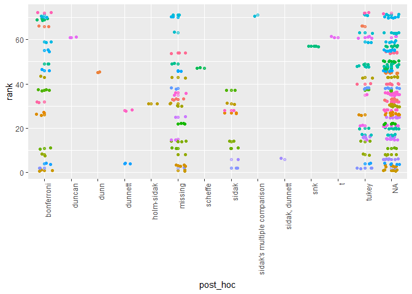<!-- -->

all tests by rank

```r
rank_vs_all_tests <- ggplot(data = interaction_data,
                                  aes(x = all_tests,
                                      y = rank,
                                      color = journal)) +
  geom_point(alpha = 0.5, show.legend = FALSE) +
  geom_jitter(width = 0.3, show.legend = FALSE) +
  theme(axis.text.x = element_blank())
#axis.text.x = element_text(angle = 90, hjust = 1))

rank_vs_all_tests
```

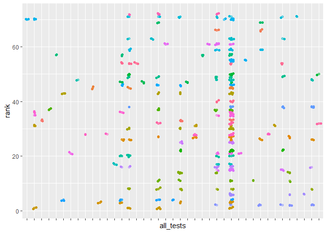<!-- -->

interaction reported by rank

```r
rank_vs_ixn_reported<- ggplot(data = interaction_data,
                                  aes(x = ixn_reported,
                                      y = rank,
                                      color = journal)) +
  geom_point(alpha = 0.5, show.legend = FALSE) +
  geom_jitter(width = 0.3, show.legend = FALSE) 

rank_vs_ixn_reported
```

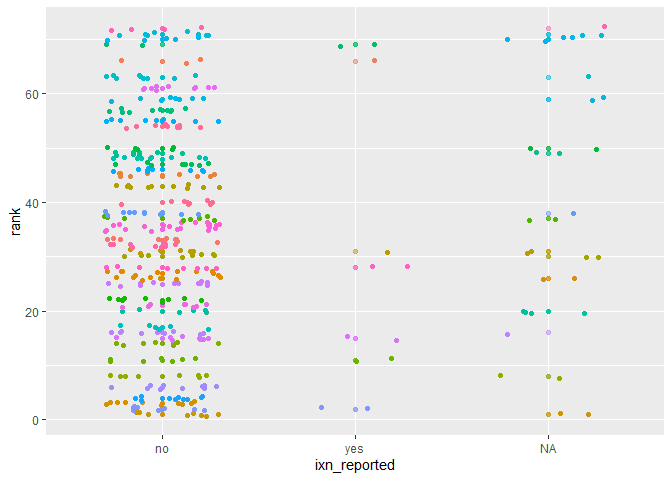<!-- -->

design vs data availability (color by journal)

```r
design_vs_data_availability_a <- ggplot(data = interaction_data,
                                      aes(x =  data_availability,
                                          y = design,
                                          color = journal)) +
  geom_point(alpha = 0.5, show.legend = FALSE) +
  geom_jitter(width = 0.3, show.legend = FALSE) 

design_vs_data_availability_a 
```

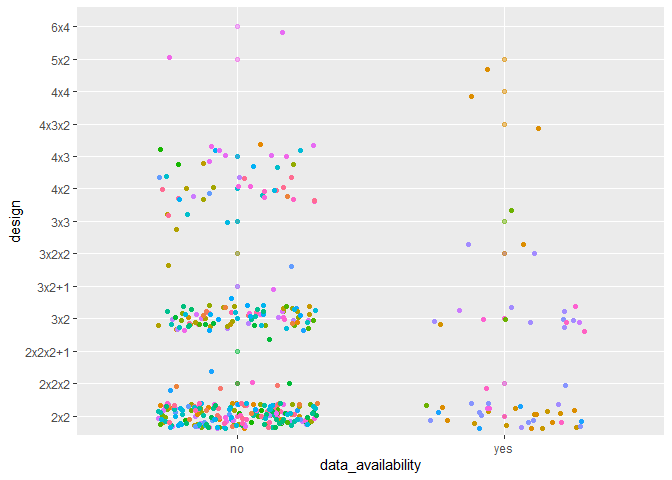<!-- -->

design vs data availability (color by rank)

```r
design_vs_data_availability <- ggplot(data = interaction_data,
                                      aes(x =  data_availability,
                                          y = design,
                                          color = rank)) +
  geom_point(alpha = 0.5, show.legend = FALSE) +
  geom_jitter(width = 0.3, show.legend = TRUE) 

design_vs_data_availability 
```

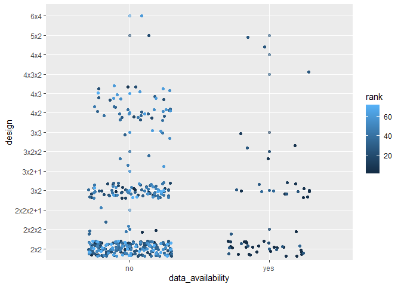<!-- -->

design vs analysis

```r
design_vs_analysis_a <- ggplot(data = interaction_data,
                               aes(x =  analysis,
                                   y = design,
                                   color = rank)) +
  geom_point(alpha = 0.5, show.legend = FALSE) +
  geom_jitter(width = 0.3, show.legend = FALSE) 

design_vs_analysis_a
```

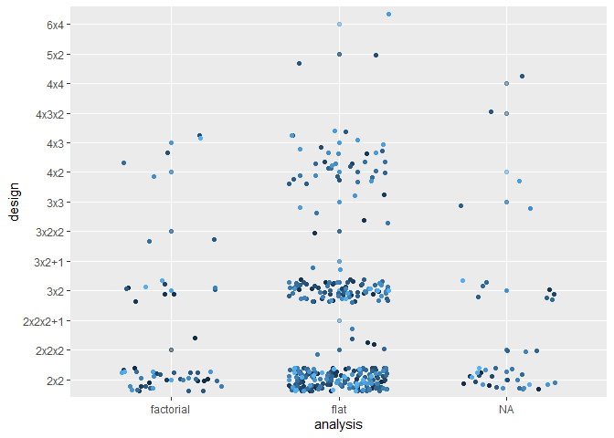<!-- -->

design vs analysis (color by tests)

```r
design_vs_analysis_b <- ggplot(data = interaction_data,
                               aes(x =  analysis,
                                   y = design,
                                   color = tests)) +
  geom_point(alpha = 0.5, show.legend = FALSE) +
  geom_jitter(width = 0.3, show.legend = FALSE) 

design_vs_analysis_b
```

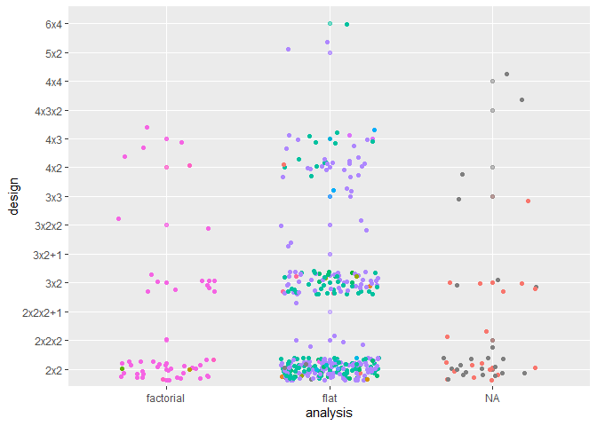<!-- -->

design vs t tests

```r
design_vs_t_tests <- ggplot(data = interaction_data,
                            aes(x =  t_tests,
                                y = design,
                                color = rank)) +
  geom_point(alpha = 0.5, show.legend = FALSE) +
  geom_jitter(width = 0.3, show.legend = TRUE) 

design_vs_t_tests
```

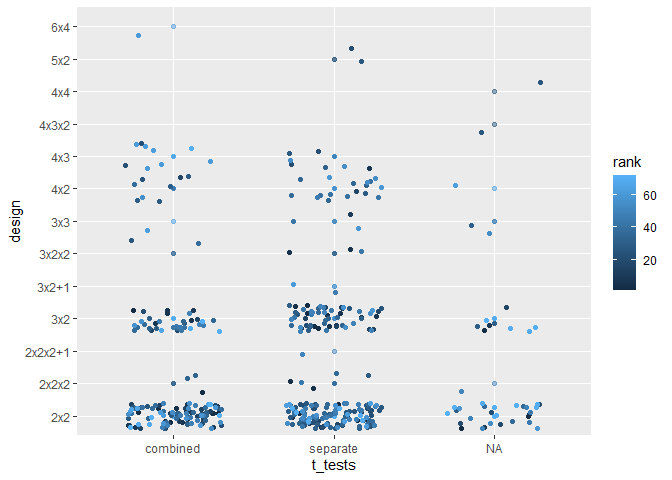<!-- -->


design vs tests (color by rank)

```r
design_vs_tests <- ggplot(data = interaction_data,
                            aes(x = tests,
                                y = design,
                                color = rank)) +
  geom_point(alpha = 0.5, show.legend = FALSE) +
  geom_jitter(width = 0.3, show.legend = TRUE) +
  theme(axis.text.x = element_text(angle = 90, hjust = 1))

design_vs_tests
```

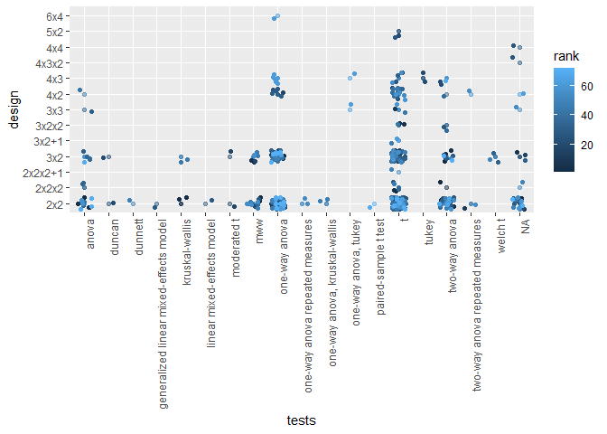<!-- -->

design vs post hoc

```r
design_vs_post_hoc <- ggplot(data = interaction_data,
                             aes(x =  post_hoc,
                                 y = design,
                                 color = rank)) +
  geom_point(alpha = 0.5, show.legend = FALSE) +
  geom_jitter(width = 0.3, show.legend = TRUE) +
  theme(axis.text.x = element_text(angle = 90, hjust = 1))

design_vs_post_hoc
```

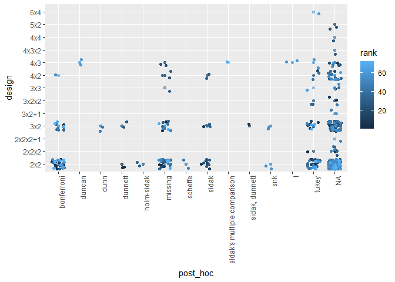<!-- -->
design vs all tests (color by rank)

```r
design_vs_all_tests <- ggplot(data = interaction_data,
                            aes(x = all_tests,
                                y = design,
                                color = rank)) +
  geom_point(alpha = 0.5, show.legend = FALSE) +
  geom_jitter(width = 0.3, show.legend = TRUE) +
  theme(axis.text.x = element_blank())
    #axis.text.x = element_text(angle = 90, hjust = 1))

design_vs_all_tests
```

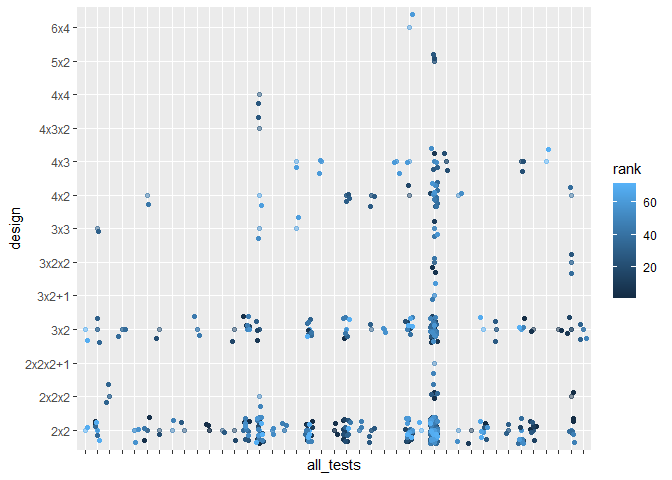<!-- -->

design vs interaction reported


```r
design_vs_ixn_reported <- ggplot(data = interaction_data,
                                 aes(x =  ixn_reported,
                                     y = design,
                                     color = rank)) +
  geom_point(alpha = 0.5, show.legend = FALSE) +
  geom_jitter(width = 0.3, show.legend = TRUE) 

design_vs_ixn_reported
```

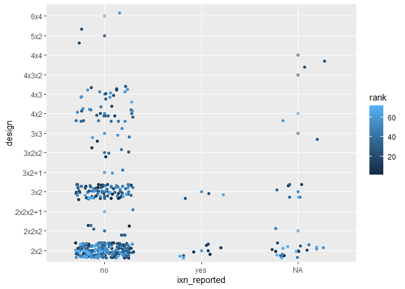<!-- -->


data availability by analysis

```r
analysis_vs_data_availability <- ggplot(data = interaction_data,
                                        aes(x =  data_availability,
                                            y = analysis,
                                            color = rank)) +
  geom_point(alpha = 0.5, show.legend = FALSE) +
  geom_jitter(width = 0.3, show.legend = TRUE) 

analysis_vs_data_availability 
```

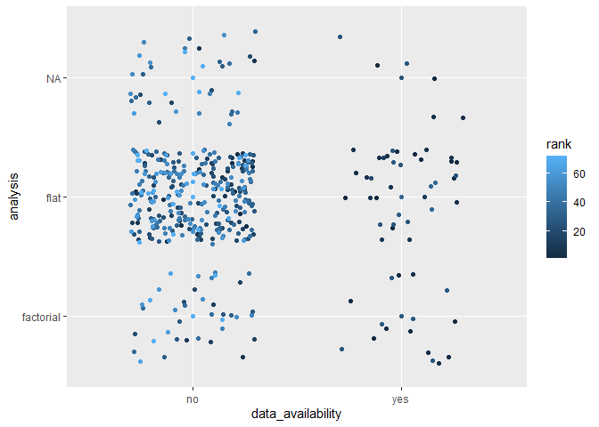<!-- -->

data availability by t tests

```r
t_tests_vs_data_availability <- ggplot(data = interaction_data,
                                       aes(x =  data_availability,
                                           y = t_tests,
                                           color = rank)) +
  geom_point(alpha = 0.5, show.legend = FALSE) +
  geom_jitter(width = 0.3, show.legend = TRUE) 

t_tests_vs_data_availability 
```

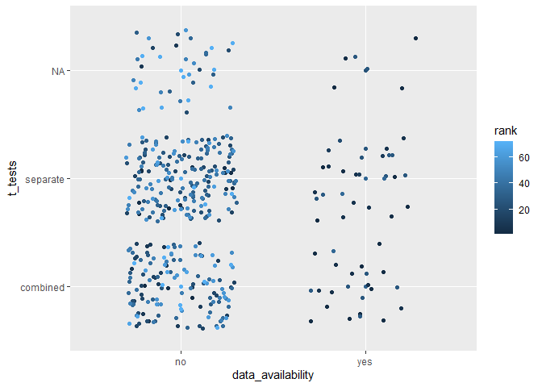<!-- -->

data availability by tests

```r
tests_vs_data_availability <- ggplot(data = interaction_data,
                                     aes(x =  data_availability,
                                         y = tests,
                                         color = rank)) +
  geom_point(alpha = 0.5, show.legend = FALSE) +
  geom_jitter(width = 0.3, show.legend = TRUE) 

tests_vs_data_availability 
```

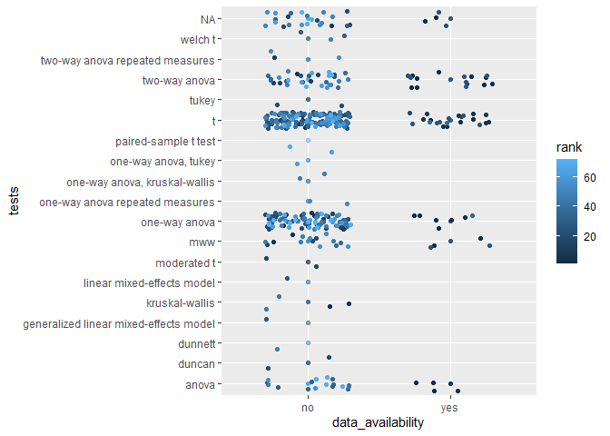<!-- -->

data availability by post hoc

```r
post_hoc_vs_data_availability <- ggplot(data = interaction_data,
                                        aes(x =  data_availability,
                                            y = post_hoc,
                                            color = rank)) +
  geom_point(alpha = 0.5, show.legend = FALSE) +
  geom_jitter(width = 0.3, show.legend = TRUE) 

post_hoc_vs_data_availability 
```

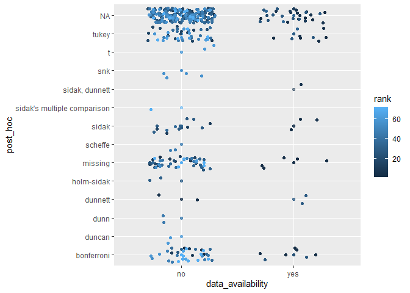<!-- -->

data availability by all tests

```r
all_tests_vs_data_availability <- ggplot(data = interaction_data,
                                     aes(x =  data_availability,
                                         y = all_tests,
                                         color = rank)) +
  geom_point(alpha = 0.5, show.legend = FALSE) +
  geom_jitter(width = 0.3, show.legend = TRUE) 

all_tests_vs_data_availability 
```

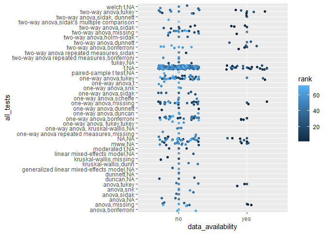<!-- -->

data availability vs interaction reported

```r
data_availability_vs_ixn_reported <- ggplot(data = interaction_data,
                                            aes(x =  ixn_reported,
                                                y = data_availability,
                                                color = rank)) +
  geom_point(alpha = 0.5, show.legend = FALSE) +
  geom_jitter(width = 0.3, show.legend = TRUE) 

data_availability_vs_ixn_reported
```

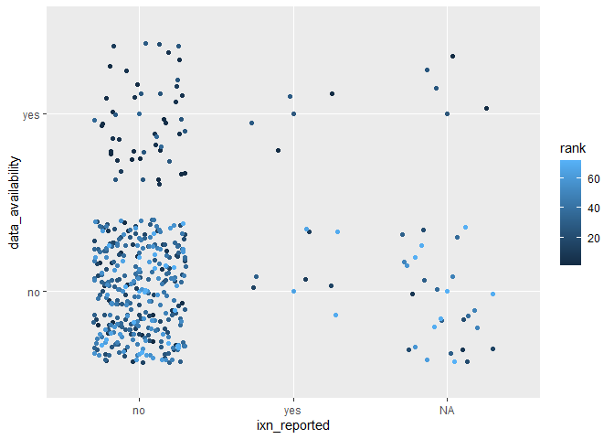<!-- -->

analysis by t tests

```r
t_tests_vs_analysis <- ggplot(data = interaction_data,
                              aes(x =  analysis,
                                  y = t_tests,
                                  color = rank)) +
  geom_point(alpha = 0.5, show.legend = FALSE) +
  geom_jitter(width = 0.3, show.legend = TRUE) 

t_tests_vs_analysis
```

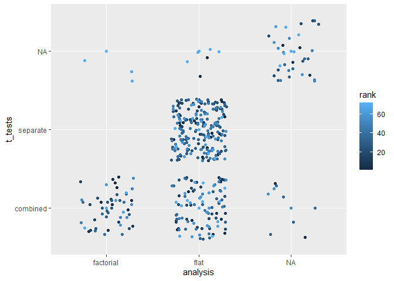<!-- -->

analysis by tests

```r
tests_vs_analysis <- ggplot(data = interaction_data,
                            aes(x =  analysis,
                                y = tests,
                                color = rank)) +
  geom_point(alpha = 0.5, show.legend = FALSE) +
  geom_jitter(width = 0.3, show.legend = TRUE) 

tests_vs_analysis
```

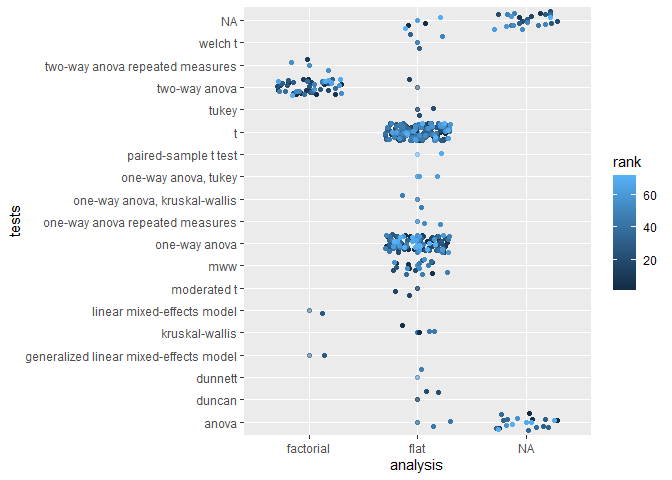<!-- -->

analysis by post hoc

```r
post_hoc_vs_analysis <- ggplot(data = interaction_data,
                               aes(x =  analysis,
                                   y = post_hoc,
                                   color = rank)) +
  geom_point(alpha = 0.5, show.legend = FALSE) +
  geom_jitter(width = 0.3, show.legend = TRUE) 

post_hoc_vs_analysis
```

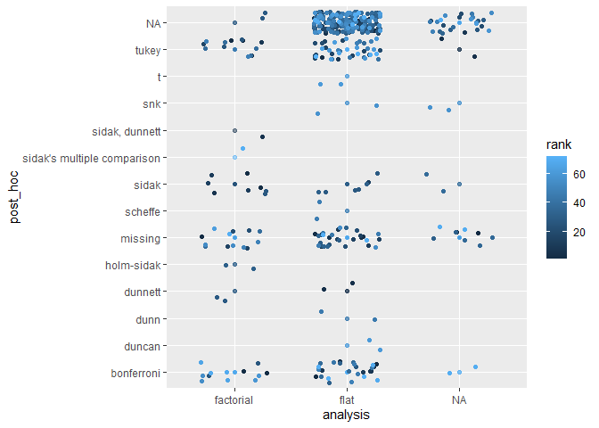<!-- -->

analysis by all tests

```r
all_tests_vs_analysis <- ggplot(data = interaction_data,
                            aes(x =  analysis,
                                y = all_tests,
                                color = rank)) +
  geom_point(alpha = 0.5, show.legend = FALSE) +
  geom_jitter(width = 0.3, show.legend = TRUE) 

all_tests_vs_analysis
```

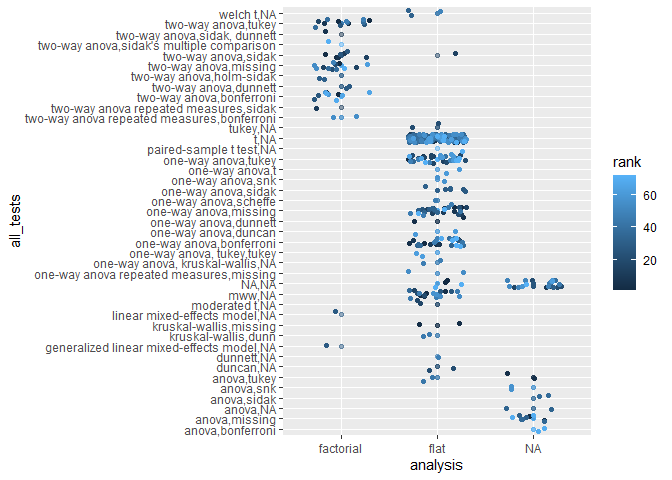<!-- -->


analysis vs interaction reported

```r
analysis_vs_ixn_reported <- ggplot(data = interaction_data,
                                   aes(x =  ixn_reported,
                                       y = analysis,
                                       color = rank)) +
  geom_point(alpha = 0.5, show.legend = FALSE) +
  geom_jitter(width = 0.3, show.legend = TRUE) 

analysis_vs_ixn_reported
```

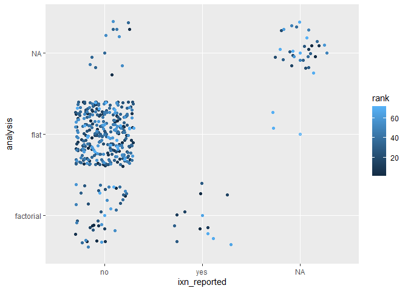<!-- -->

t tests vs tests

```r
tests_vs_t_tests <- ggplot(data = interaction_data,
                           aes(x =  t_tests,
                               y = tests,
                               color = rank)) +
  geom_point(alpha = 0.5, show.legend = FALSE) +
  geom_jitter(width = 0.3, show.legend = TRUE) 

tests_vs_t_tests
```

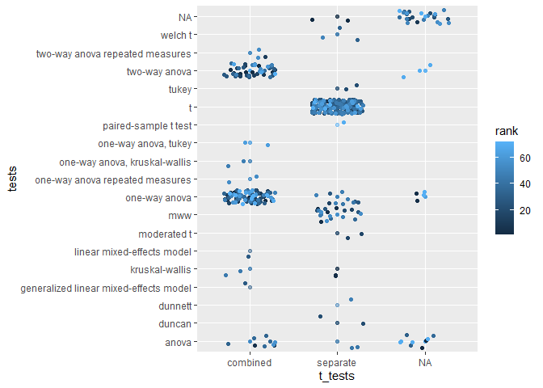<!-- -->

t tests vs post hoc

```r
t_tests_vs_post_hoc <- ggplot(data = interaction_data,
                                  aes(x =  post_hoc,
                                      y = t_tests,
                                      color = rank)) +
  geom_point(alpha = 0.5, show.legend = FALSE) +
  geom_jitter(width = 0.3, show.legend = TRUE) +
  theme(axis.text.x = element_text(angle = 90, hjust = 1))
 
t_tests_vs_post_hoc
```

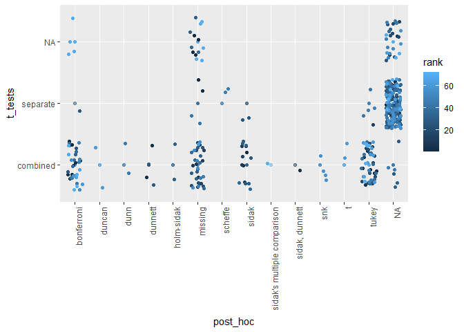<!-- -->


all tests vs t tests

```r
all_tests_vs_t_tests <- ggplot(data = interaction_data,
                           aes(x =  t_tests,
                               y = all_tests,
                               color = rank)) +
  geom_point(alpha = 0.5, show.legend = FALSE) +
  geom_jitter(width = 0.3, show.legend = TRUE) 

all_tests_vs_t_tests
```

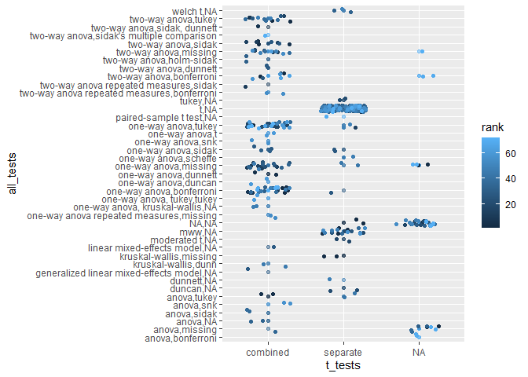<!-- -->

t tests vs interaction reported

```r
t_tests_vs_ixn_reported <- ggplot(data = interaction_data,
                                  aes(x =  ixn_reported,
                                      y = t_tests,
                                      color = rank)) +
  geom_point(alpha = 0.5, show.legend = FALSE) +
  geom_jitter(width = 0.3, show.legend = TRUE) 

t_tests_vs_ixn_reported
```

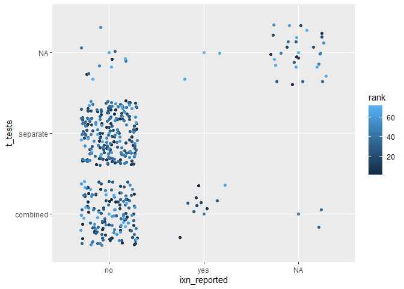<!-- -->

tests vs post hoc

```r
tests_vs_post_hoc <- ggplot(data = interaction_data,
                                aes(x =  post_hoc,
                                    y = tests,
                                    color = rank)) +
  geom_point(alpha = 0.5, show.legend = FALSE) +
  geom_jitter(width = 0.3, show.legend = TRUE) +
  theme(axis.text.x = element_text(angle = 90, hjust = 1))

tests_vs_post_hoc
```

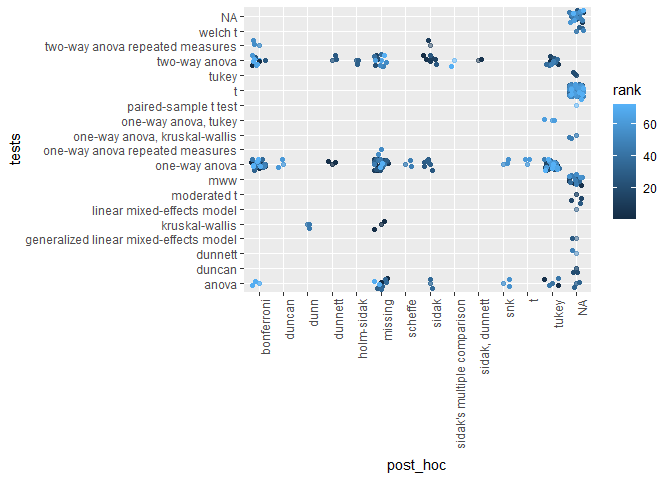<!-- -->

tests vs interaction reported

```r
tests_vs_ixn_reported <- ggplot(data = interaction_data,
                                aes(x =  ixn_reported,
                                    y = tests,
                                    color = rank)) +
  geom_point(alpha = 0.5, show.legend = FALSE) +
  geom_jitter(width = 0.3, show.legend = TRUE) 

tests_vs_ixn_reported
```

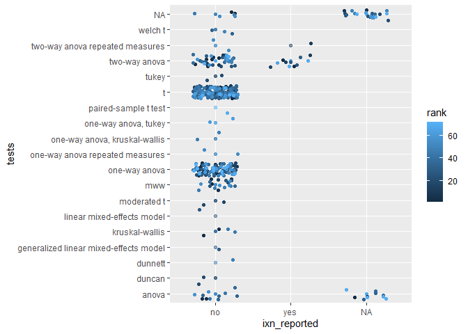<!-- -->


```r
post_hoc_vs_ixn_reported <- ggplot(data = interaction_data,
                                   aes(x =  ixn_reported,
                                       y = post_hoc,
                                       color = rank)) +
  geom_point(alpha = 0.5, show.legend = FALSE) +
  geom_jitter(width = 0.3, show.legend = TRUE) 

post_hoc_vs_ixn_reported
```

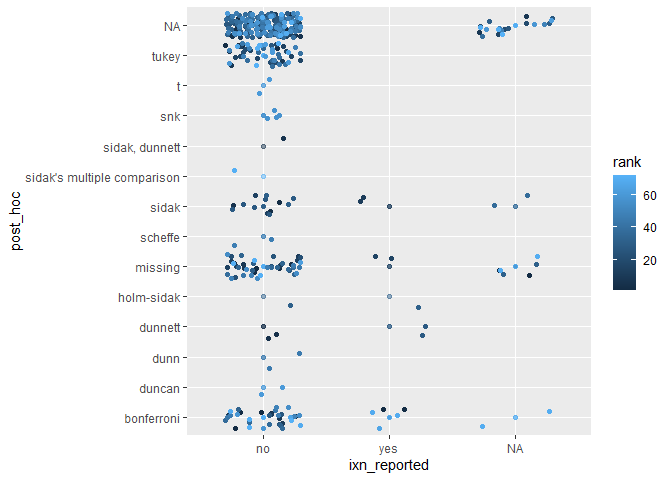<!-- -->


all tests vs interaction reported

```r
all_tests_vs_ixn_reported <- ggplot(data = interaction_data,
                                aes(x =  ixn_reported,
                                    y = all_tests,
                                    color = rank)) +
  geom_point(alpha = 0.5, show.legend = FALSE) +
  geom_jitter(width = 0.3, show.legend = TRUE) 

all_tests_vs_ixn_reported
```

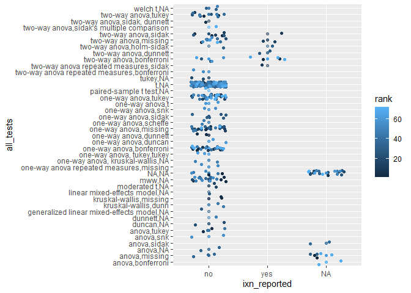<!-- -->


```r
#png( "mygraph1.png", width = 864, height = 864)
#p <- ggplot(interaction_data, aes(ixn_reported, analysis)) + geom_point()

#p + facet_grid(vars(data_availability), vars(design))
```


```r
#png( "mygraph2.png", width = 2304, height = 1536)
#p <- ggplot(interaction_data, aes(ixn_reported, analysis)) + geom_point()

#p + facet_grid(vars(design), vars(rank))
```


Example 1: Estimation of a treatment effect relative to a control effect (“Something different”) 

Example 2: Estimation of the effect of background condition on an effect (“it depends”)  

Example 3: Estimation of synergy (“More than the sum of the parts”)    
  used "synergy" and have data available:  
    https://doi.org/10.1126/scisignal.aay0482  
        data available is not what we need  
    https://doi.org/10.1038/s42255-019-0122-z  
      two-way anova for: fig 2d, i. 3k. 4h (longitudinal), 5d.  
    https://doi.org/10.1016/j.cell.2020.05.053  
      only factorial analysis was for longitudinal data  
    

