    data_folder <- "factorial_design"
    data_from <- "Interaction"
    file_name <- "interaction - testing.xlsx"

    file_path <- here(data_folder, data_from, file_name)
    interaction_data_table <- read_excel(file_path,
                        sheet = "Sheet1",
                        range = "B1:Q436") %>%
      clean_names()  %>%
      data.table()
      interaction_data <- interaction_data_table[c(6, 12, 19, 25, 27:30, 33:39, 41, 42, 44:46, 48, 50:55, 57:68, 72:82, 84:436),-c("jaw_tests", "comment")] #relevant rows
      #na.omit() # danger!

    #View(interaction_data)

    #Import as csv

    #data_folder <- "factorial_design"

    #data_from <- "Interaction"
    #file_name <- "interaction - testing - Sheet1.csv"
    #file_path <- here(data_folder, data_from, file_name)

    #Import CSV file

    #interaction_data <- read.csv(file_path, header = TRUE, fileEncoding="UTF-8-BOM") %>%
    #  data.table() %>%
    #  clean_names()

    #View(interaction_data)

    journal_vs_ixn_reported <- ggplot(data = interaction_data,
                                 aes(x =  ixn_reported,
                                     y = journal,
                                     color = journal)) +
      geom_point(alpha = 0.5, show.legend = FALSE) +
      geom_jitter(width = 0.3, show.legend = FALSE) 

    journal_vs_ixn_reported

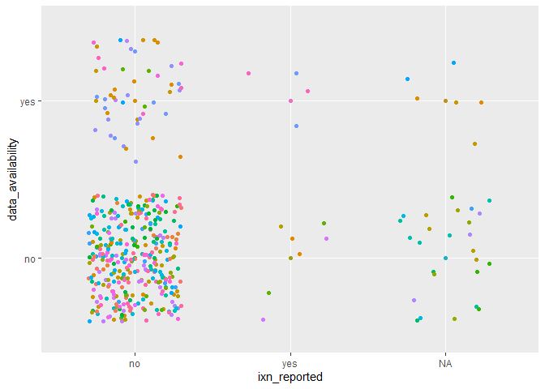

    data_availability_vs_ixn_reported <- ggplot(data = interaction_data,
                                 aes(x =  ixn_reported,
                                     y = data_availability,
                                     color = journal)) +
      geom_point(alpha = 0.5, show.legend = FALSE) +
      geom_jitter(width = 0.3, show.legend = FALSE) 

    data_availability_vs_ixn_reported

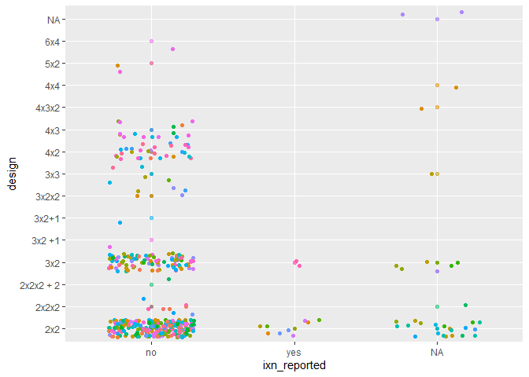

    design_vs_ixn_reported <- ggplot(data = interaction_data,
                                 aes(x =  ixn_reported,
                                     y = design,
                                     color = journal)) +
      geom_point(alpha = 0.5, show.legend = FALSE) +
      geom_jitter(width = 0.3, show.legend = FALSE) 

    design_vs_ixn_reported

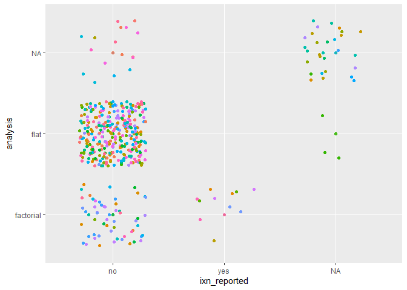

    analysis_vs_ixn_reported <- ggplot(data = interaction_data,
                                 aes(x =  ixn_reported,
                                     y = analysis,
                                     color = journal)) +
      geom_point(alpha = 0.5, show.legend = FALSE) +
      geom_jitter(width = 0.3, show.legend = FALSE) 

    analysis_vs_ixn_reported

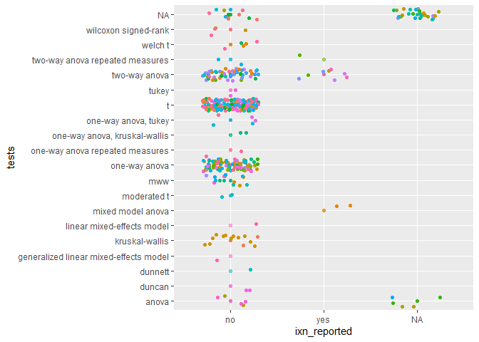

    tests_vs_ixn_reported <- ggplot(data = interaction_data,
                                 aes(x =  ixn_reported,
                                     y = tests,
                                     color = journal)) +
      geom_point(alpha = 0.5, show.legend = FALSE) +
      geom_jitter(width = 0.3, show.legend = FALSE) 

    tests_vs_ixn_reported

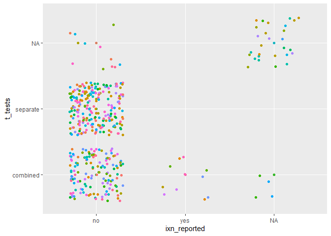

    t_tests_vs_ixn_reported <- ggplot(data = interaction_data,
                                 aes(x =  ixn_reported,
                                     y = t_tests,
                                     color = journal)) +
      geom_point(alpha = 0.5, show.legend = FALSE) +
      geom_jitter(width = 0.3, show.legend = FALSE) 

    t_tests_vs_ixn_reported

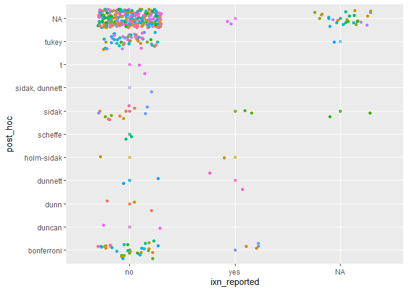

    post_hoc_vs_ixn_reported <- ggplot(data = interaction_data,
                                 aes(x =  ixn_reported,
                                     y = post_hoc,
                                     color = journal)) +
      geom_point(alpha = 0.5, show.legend = FALSE) +
      geom_jitter(width = 0.3, show.legend = FALSE) 

    post_hoc_vs_ixn_reported

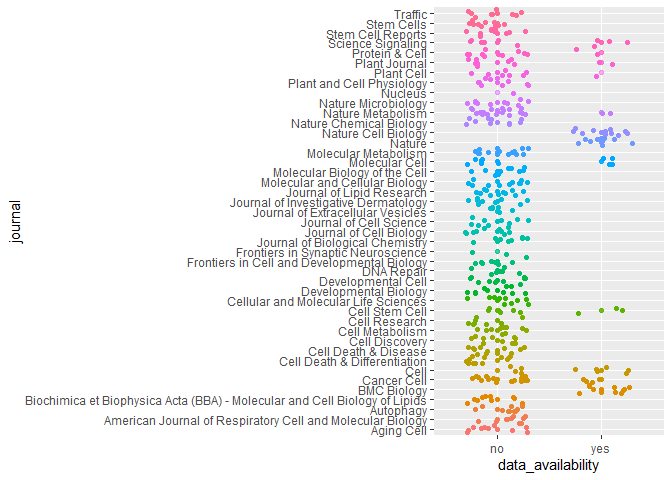

    journal_vs_data_availability <- ggplot(data = interaction_data,
                                 aes(x =  data_availability,
                                     y = journal,
                                     color = journal)) +
      geom_point(alpha = 0.5, show.legend = FALSE) +
      geom_jitter(width = 0.3, show.legend = FALSE) 

    journal_vs_data_availability

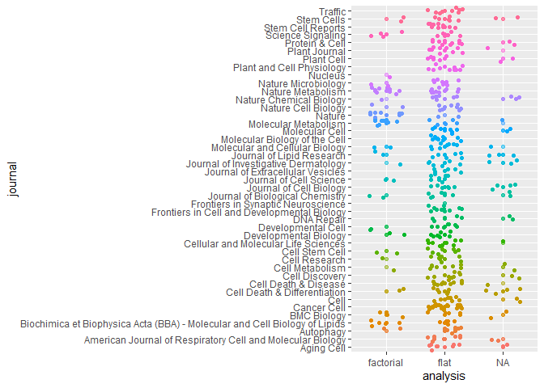

    journal_vs_analysis_a <- ggplot(data = interaction_data,
                                 aes(x =  analysis,
                                     y = journal,
                                     color = journal)) +
      geom_point(alpha = 0.5, show.legend = FALSE) +
      geom_jitter(width = 0.3, show.legend = FALSE) 

    journal_vs_analysis_a

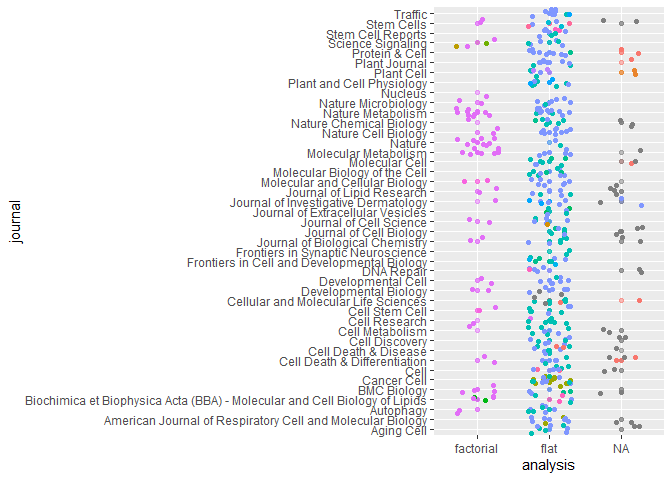

    journal_vs_analysis_b <- ggplot(data = interaction_data,
                                 aes(x =  analysis,
                                     y = journal,
                                     color = tests)) +
      geom_point(alpha = 0.5, show.legend = FALSE) +
      geom_jitter(width = 0.3, show.legend = FALSE) 

    journal_vs_analysis_b

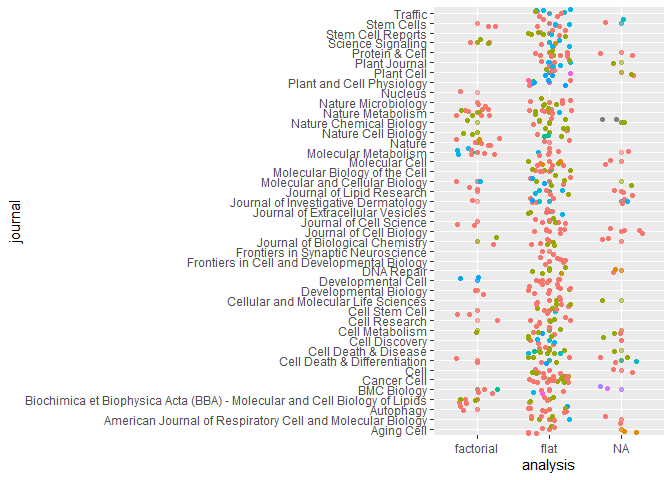

    journal_vs_analysis_c <- ggplot(data = interaction_data,
                                 aes(x =  analysis,
                                     y = journal,
                                     color = design)) +
      geom_point(alpha = 0.5, show.legend = FALSE) +
      geom_jitter(width = 0.3, show.legend = FALSE) 

    journal_vs_analysis_c

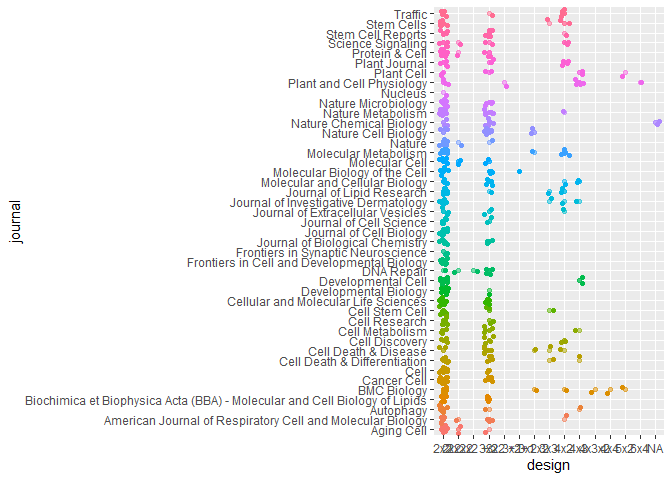

    journal_vs_design <- ggplot(data = interaction_data,
                                 aes(x =  design,
                                     y = journal,
                                     color = journal)) +
      geom_point(alpha = 0.5, show.legend = FALSE) +
      geom_jitter(width = 0.3, show.legend = FALSE) 

    journal_vs_design

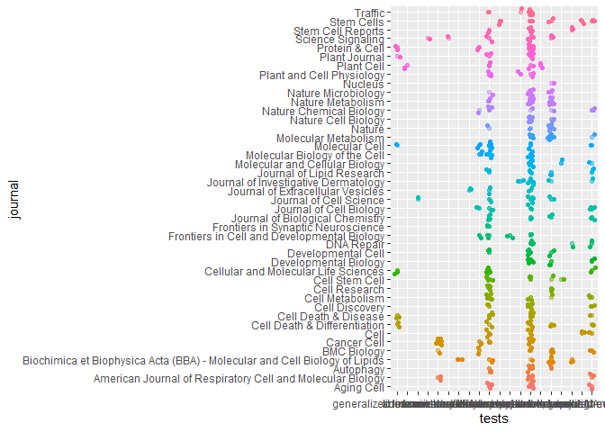

    journal_vs_tests <- ggplot(data = interaction_data,
                                 aes(x =  tests,
                                     y = journal,
                                     color = journal)) +
      geom_point(alpha = 0.5, show.legend = FALSE) +
      geom_jitter(width = 0.3, show.legend = FALSE) 

    journal_vs_tests

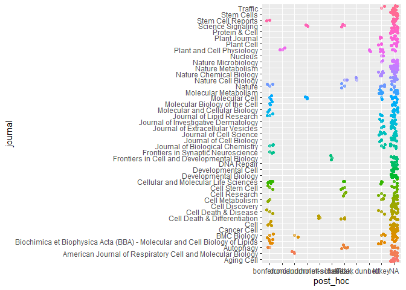

    journal_vs_post_hoc <- ggplot(data = interaction_data,
                                 aes(x =  post_hoc,
                                     y = journal,
                                     color = journal)) +
      geom_point(alpha = 0.5, show.legend = FALSE) +
      geom_jitter(width = 0.3, show.legend = FALSE) 

    journal_vs_post_hoc

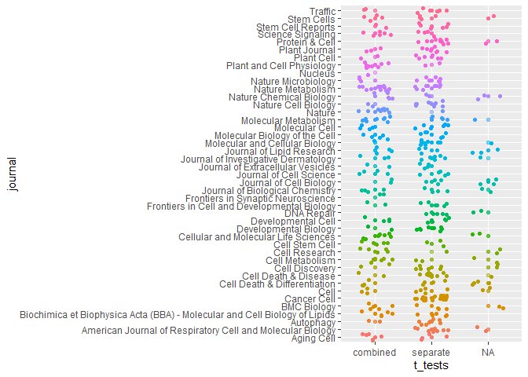

    journal_vs_t_tests <- ggplot(data = interaction_data,
                                 aes(x =  t_tests,
                                     y = journal,
                                     color = journal)) +
      geom_point(alpha = 0.5, show.legend = FALSE) +
      geom_jitter(width = 0.3, show.legend = FALSE) 

    journal_vs_t_tests

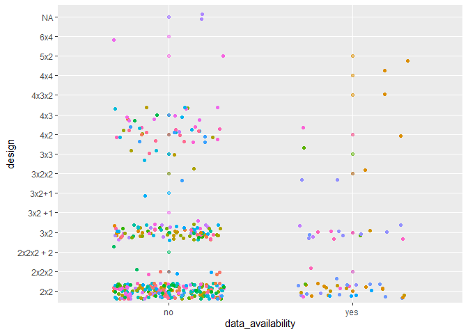

    design_vs_data_availability <- ggplot(data = interaction_data,
                                 aes(x =  data_availability,
                                     y = design,
                                     color = journal)) +
      geom_point(alpha = 0.5, show.legend = FALSE) +
      geom_jitter(width = 0.3, show.legend = FALSE) 

    design_vs_data_availability 

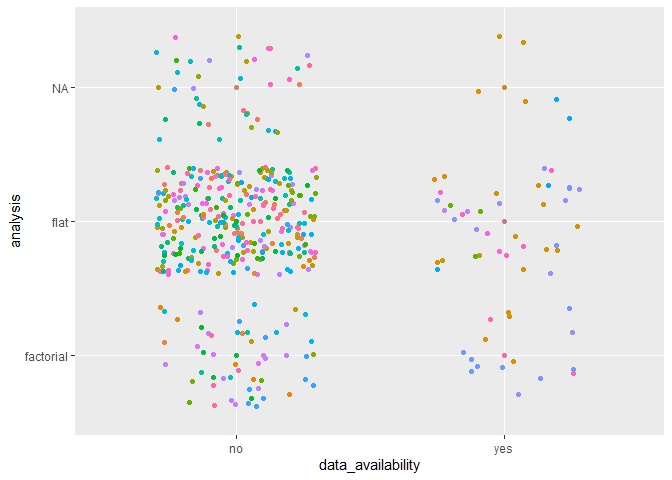

    analysis_vs_data_availability <- ggplot(data = interaction_data,
                                 aes(x =  data_availability,
                                     y = analysis,
                                     color = journal)) +
      geom_point(alpha = 0.5, show.legend = FALSE) +
      geom_jitter(width = 0.3, show.legend = FALSE) 

    analysis_vs_data_availability 

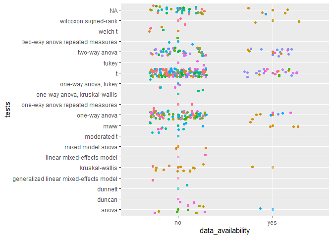

    tests_vs_data_availability <- ggplot(data = interaction_data,
                                 aes(x =  data_availability,
                                     y = tests,
                                     color = journal)) +
      geom_point(alpha = 0.5, show.legend = FALSE) +
      geom_jitter(width = 0.3, show.legend = FALSE) 

    tests_vs_data_availability 

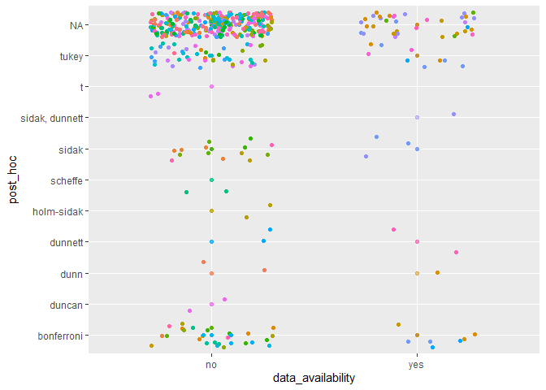

    post_hoc_vs_data_availability <- ggplot(data = interaction_data,
                                 aes(x =  data_availability,
                                     y = post_hoc,
                                     color = journal)) +
      geom_point(alpha = 0.5, show.legend = FALSE) +
      geom_jitter(width = 0.3, show.legend = FALSE) 

    post_hoc_vs_data_availability 

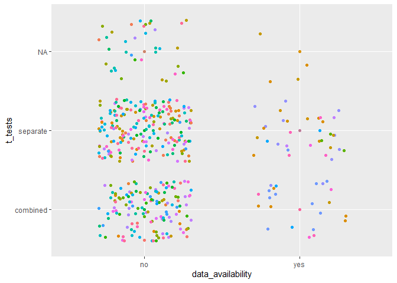

    t_tests_vs_data_availability <- ggplot(data = interaction_data,
                                 aes(x =  data_availability,
                                     y = t_tests,
                                     color = journal)) +
      geom_point(alpha = 0.5, show.legend = FALSE) +
      geom_jitter(width = 0.3, show.legend = FALSE) 

    t_tests_vs_data_availability 

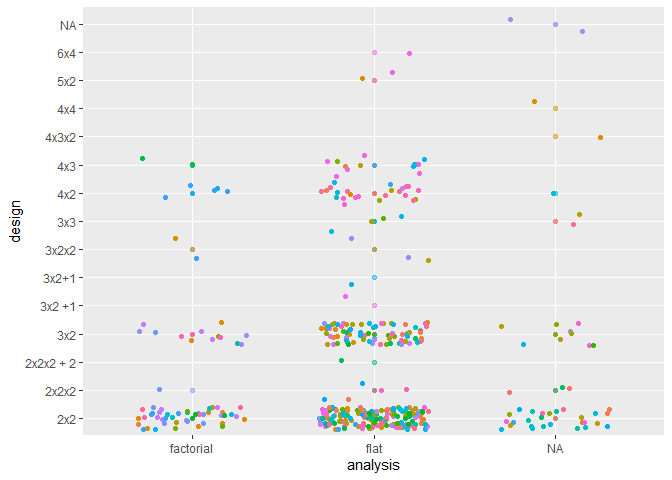

    design_vs_analysis_a <- ggplot(data = interaction_data,
                                 aes(x =  analysis,
                                     y = design,
                                     color = journal)) +
      geom_point(alpha = 0.5, show.legend = FALSE) +
      geom_jitter(width = 0.3, show.legend = FALSE) 

    design_vs_analysis_a

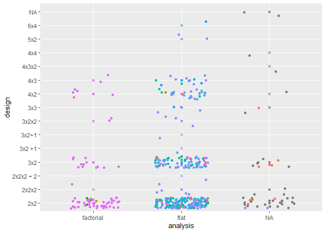

    design_vs_analysis_b <- ggplot(data = interaction_data,
                                 aes(x =  analysis,
                                     y = design,
                                     color = tests)) +
      geom_point(alpha = 0.5, show.legend = FALSE) +
      geom_jitter(width = 0.3, show.legend = FALSE) 

    design_vs_analysis_b

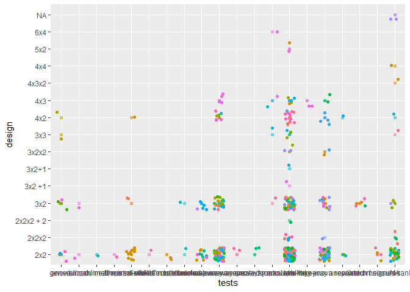

    design_vs_tests <- ggplot(data = interaction_data,
                                 aes(x =  tests,
                                     y = design,
                                     color = journal)) +
      geom_point(alpha = 0.5, show.legend = FALSE) +
      geom_jitter(width = 0.3, show.legend = FALSE) 

    design_vs_tests

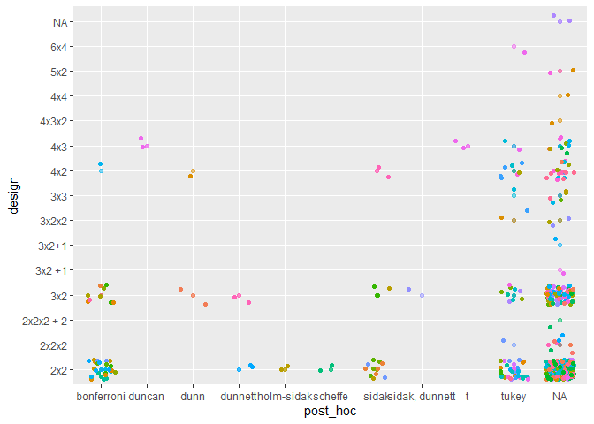

    design_vs_post_hoc <- ggplot(data = interaction_data,
                                 aes(x =  post_hoc,
                                     y = design,
                                     color = journal)) +
      geom_point(alpha = 0.5, show.legend = FALSE) +
      geom_jitter(width = 0.3, show.legend = FALSE) 

    design_vs_post_hoc

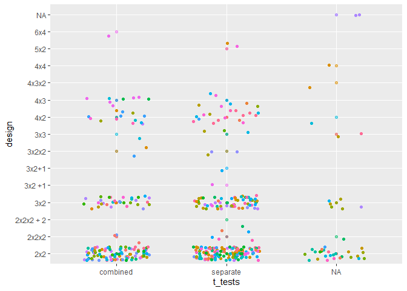

    design_vs_t_tests <- ggplot(data = interaction_data,
                                 aes(x =  t_tests,
                                     y = design,
                                     color = journal)) +
      geom_point(alpha = 0.5, show.legend = FALSE) +
      geom_jitter(width = 0.3, show.legend = FALSE) 

    design_vs_t_tests

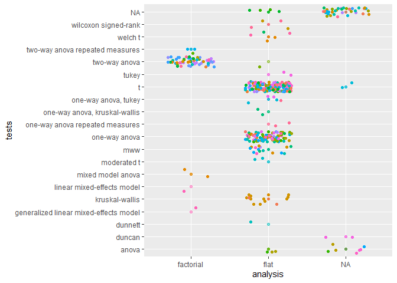

    tests_vs_analysis <- ggplot(data = interaction_data,
                                 aes(x =  analysis,
                                     y = tests,
                                     color = journal)) +
      geom_point(alpha = 0.5, show.legend = FALSE) +
      geom_jitter(width = 0.3, show.legend = FALSE) 

    tests_vs_analysis

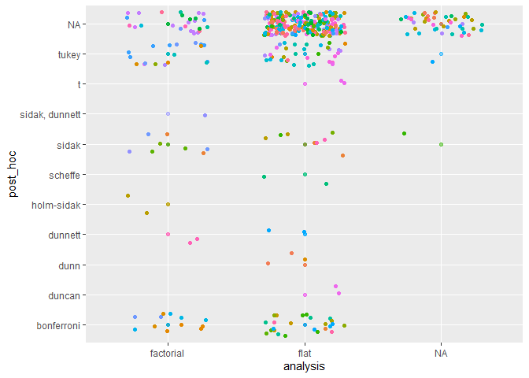

    post_hoc_vs_analysis <- ggplot(data = interaction_data,
                                 aes(x =  analysis,
                                     y = post_hoc,
                                     color = journal)) +
      geom_point(alpha = 0.5, show.legend = FALSE) +
      geom_jitter(width = 0.3, show.legend = FALSE) 

    post_hoc_vs_analysis

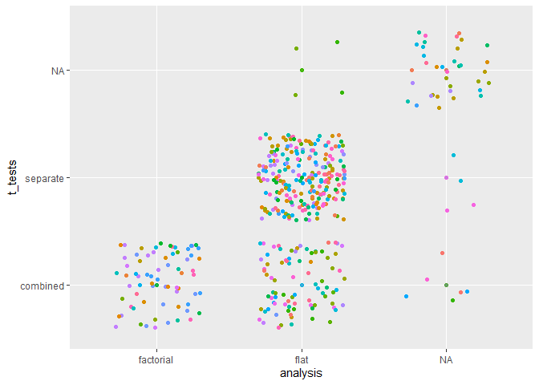

    t_tests_vs_analysis <- ggplot(data = interaction_data,
                                 aes(x =  analysis,
                                     y = t_tests,
                                     color = journal)) +
      geom_point(alpha = 0.5, show.legend = FALSE) +
      geom_jitter(width = 0.3, show.legend = FALSE) 

    t_tests_vs_analysis

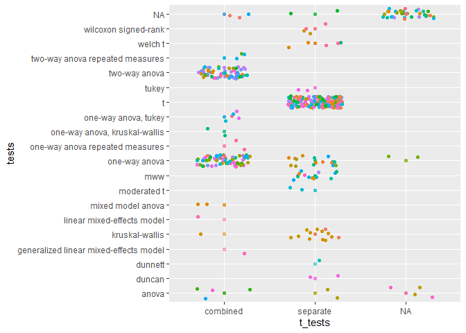

    tests_vs_t_tests <- ggplot(data = interaction_data,
                                 aes(x =  t_tests,
                                     y = tests,
                                     color = journal)) +
      geom_point(alpha = 0.5, show.legend = FALSE) +
      geom_jitter(width = 0.3, show.legend = FALSE) 

    tests_vs_t_tests

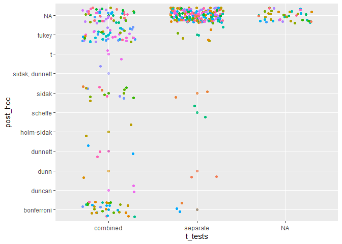

    post_hoc_vs_t_tests <- ggplot(data = interaction_data,
                                 aes(x =  t_tests,
                                     y = post_hoc,
                                     color = journal)) +
      geom_point(alpha = 0.5, show.legend = FALSE) +
      geom_jitter(width = 0.3, show.legend = FALSE) 

    post_hoc_vs_t_tests

